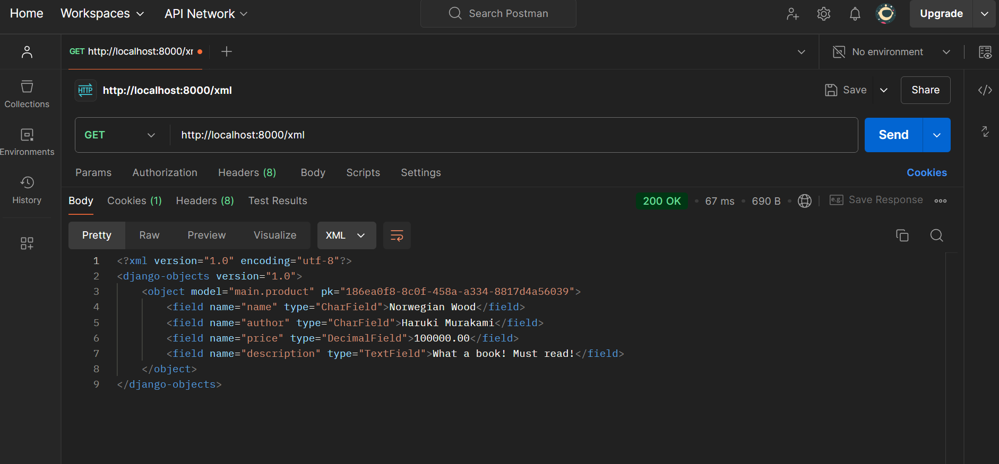
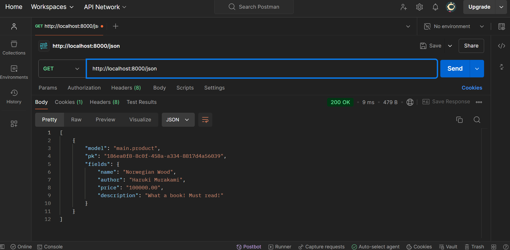
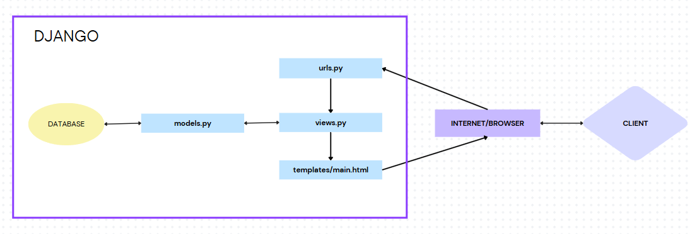

# Platform Based Programming Individual Assignment

| NAME               | ID         | PBP CLASS |
| ------------------ | ---------- | --------- |
| Sultan Ibnu Mansiz | 2306275840 | D         |

Pada tugas ini, saya membuat suatu projek e-commerce sederhana bernama "Second Chapters <3" dengan ide menjual buku-buku bekas. Saya menggunakan konsep _Model-View-Template_ (MVT) pada Django untuk membangun projek ini.

- LINK: [Second Chapters <3](http://sultan-ibnu-prelovedbooks.pbp.cs.ui.ac.id/)

# Assignment 6: JavaScript and AJAX

## Checklist Tugas

- [x] Mengubah tugas 5 yang telah dibuat sebelumnya menjadi menggunakan AJAX.

  - [x] AJAX `GET`

    - [x] Ubahlah kode `cards` data _mood_ agar dapat mendukung AJAX `GET`.

    - [x] Lakukan pengambilan data _mood_ menggunakan AJAX `GET`. Pastikan bahwa data yang diambil hanyalah data milik pengguna yang _logged-in_.
  
  - [x] AJAX `POST`

    - [x] Buatlah sebuah tombol yang membuka sebuah modal dengan form untuk menambahkan _mood_.

    - [x] Buatlah fungsi _view_ baru untuk menambahkan _mood_ baru ke dalam basis data.

    - [x] Buatlah _path_ `/create-ajax/` yang mengarah ke fungsi _view_ yang baru kamu buat.

    - [x] Hubungkan form yang telah kamu buat di dalam modal kamu ke _path_ `/create-ajax/`.

- [x] Menjawab beberapa pertanyaan berikut pada `README.md` pada _root folder_ (silakan modifikasi `README.md` yang telah kamu buat sebelumnya; tambahkan subjudul untuk setiap tugas).

### Jelaskan manfaat dari penggunaan JavaScript dalam pengembangan aplikasi web!
Dari apa yang sudah dijelaskan di tutorial minggu ini, saya merangkum beberapa poin tentang manfaat JavaScript dalam pengembangan aplikasi web

* Multi-paradigma: JavaScript mendukung beberapa gaya pemrograman seperti berbasis objek, imperatif, dan fungsional, sehingga fleksibel untuk berbagai kebutuhan pengembangan.

* Dinamis: JavaScript memungkinkan manipulasi halaman web secara dinamis, seperti mengubah konten dan tampilan halaman tanpa perlu memuat ulang halaman sepenuhnya.

* Interaksi yang lebih baik dengan pengguna: JavaScript meningkatkan interaksi antara halaman web dan pengguna, misalnya melalui animasi, validasi form, atau respons instan terhadap input pengguna.

* Pengubahan gaya dinamis: JavaScript bisa digunakan untuk mengubah styling dan CSS dari elemen HTML secara real-time, memberikan pengalaman visual yang lebih interaktif.

* Client-side execution: Kode JavaScript umumnya dijalankan di sisi pengguna (client-side), sehingga tidak membebani performa server dan memberikan pengalaman pengguna yang lebih responsif.

* Server-side capabilities: Dengan platform seperti Node.js, JavaScript juga dapat digunakan pada server-side, memberikan fleksibilitas tambahan untuk menjalankan JavaScript di berbagai lingkungan.


### Jelaskan fungsi dari penggunaan `await` ketika kita menggunakan `fetch()`! Apa yang akan terjadi jika kita tidak menggunakan `await`?
Fungsi `await` memungkinkan kita untuk menggunakana AJAX tanpa perlu menggunakan library eksternal, seperti jQuery. AJAX sendiri berfungsi untuk meminta data dari dari _web server_ menggunakan `XMLHttpRequest` dan menampilkannya dengan JavaScript dan HTML DOM. `fetch()` sendiri berfungsi sebagai pengganti yang lebih kuat dan fleksibel dari `XMLHttpRequest`. `await` dalam `fetch()` berfungsi menghentikan program untuk sementara sampai `fetch()` selesai dan hasilnya tersedia. Jika tidak menggunakan `await` dalam `fetch()`, `fetch()` akan langsung menampilkan _promise_ tanpa menunggu hasilnya tersedia. 

### Mengapa kita perlu menggunakan _decorator_ `csrf_exempt` pada _view_ yang akan digunakan untuk AJAX `POST`?
Seperti yang dijelaskan di tutorial, _decorator_ `csrf_exempt` membuat Django tidak perlu mengecek keberadaan `csrf_token` pada `POST` _request_ yang dikirimkan ke `create_product_ajax`. 

Ketika _decorator_ `csrf_exempt` ditambahkan ke fungsi di `view`, Django mengabaikan perlindungan `CSRF` untuk `view` tersebut. Jadi, _request_ `POST` ke fungsi ini tidak perlu menyertakan `csrf_token`. Ini berguna dalam situasi seperti AJAX _request_ dari aplikasi atau lingkungan yang dipercaya, di mana kita ingin mengabaikan mekanisme perlindungan `CSRF`. Namun, menggunakan `csrf_exempt` dapat meningkatkan risiko keamanan, sehingga perlu diterapkan dengan hati-hati. Pada tutorial ini, mungkin penggunaan _decorator_ `csrf_exempt` bertujuan untuk mengajarkan kita tentang kewaspadaan terhadap keamanan web yang kita buat.


### Pada tutorial PBP minggu ini, pembersihan data _input_ pengguna dilakukan di belakang (_backend_) juga. Mengapa hal tersebut tidak dilakukan di _frontend_ saja?

* Frontend Bukan Tempat yang Aman untuk Validasi
  Validasi di _frontend_ bisa dengan mudah dilewati karena kode di _browser_ berada di bawah kontrol _user_. _User_ dapat memodifikasi atau menghapus validasi ini menggunakan alat seperti developer tools atau Postman. Jika aplikasi hanya mengandalkan _frontend_, _server_ masih bisa menerima data yang tidak aman.

* _Backend_ Adalah Pertahanan Terakhir
  _Backend_ adalah tempat paling aman untuk memastikan data benar-benar aman. _Input_ dari _user_ harus selalu dianggap tidak terpercaya sampai divalidasi dan dibersihkan di _server_. Tanpa validasi di _backend_, data berbahaya seperti XSS bisa tersimpan di _database_. Contoh serangan XSS sudah jelas dilakukan di tutorial dan menunjukkan bahwa validasi di _frontend_ tidak dapat melindungi aplikasi dari serangan.

* Melindungi API dan Akses Lain
  Selain validasi _frontend_, pembersihan di _backend_ juga melindungi API dan layanan lain seperti `JSON` atau `XML` yang tidak diakses melalui browser. Library frontend seperti `DOMPurify` hanya bekerja untuk pembersihan data yang ditampilkan sebagai HTML. Seperti yang sudah dijelaskan di tutorial, jika ada yang menggunakan API `/json` atau `/xml` dari aplikasi kita, maka data yang didapatkan masih data yang "kotor". Oleh karena itu, _backend_ harus tetap memastikan bahwa semua _input_, termasuk yang diterima melalui API, sudah divalidasi dan dibersihkan untuk mencegah distribusi data yang tidak aman ke _user_ atau sistem lain.

### Jelaskan bagaimana cara kamu mengimplementasikan _checklist_ di atas secara _step-by-step_ (bukan hanya sekadar mengikuti tutorial)!

* Mengubah fitur pengambilan data pada _product_ dapat dilakukan dengan AJAX `GET`
  
  - Pada `views.py` saya melakukan impor beberapa _decorator_ dan menambahkan fungsi baru untuk melakukan penambahan product dengan AJAX.
    ```python
    from django.views.decorators.csrf import csrf_exempt
    from django.views.decorators.http import require_POS
    ...

    ...
    @csrf_exempt
    @require_POST
    def create_product_ajax(request):
        name = strip_tags(request.POST.get("name"))
        author = strip_tags(request.POST.get("author"))
        price = request.POST.get("price")
        description = strip_tags(request.POST.get("description"))
        user = request.user

        new_product = Product(
            name=name, author=author,
            price=price,
            description=description,
            user=user
        )
        new_product.save()

        return HttpResponse(b"CREATED", status=201)
    ...
    ```

  - Setelah itu di `urls.py`, saya menambahkan _routing_ untuk fungsi yang sebelumnya dibuat
    ```python
    from main.views import ..., creaet_product_ajax
    ...

    urlpatterns = [
      ...
      path('create-product-ajax', create_product_ajax, name='create_product_ajax'),
    ]

    ```

  - Kita akan mendapatkan objek-objek _product_ dari endpoint `/json`. Buka `main.html` yang berada di `main/templates/` dan tambahkan code di bawah
    ```html
    ...
    <div id="product_cards"></div>
    ...

    <script>
      async function getProducts(){
          return fetch("").then((res) => res.json())
      }
    </script>
    ```
    Selain menambahkan fungsi untuk mendapat objek _product_, saya menambahkan juga fungsi untuk _refresh_ data _products_ secara asinkronus 
    bernama `refreshProducts` di dalam tag `<script>`

  - Masih di file yang sama, saya mengimplementasikan modal sebagai form untuk menambahkan product dan mengimplementasi fungsi yang berguna agar modal berjalan dan menambahkan button.
    ```html
    ...
    <div class="flex justify-center mb-6">
      <button data-modal-target="crudModal" data-modal-toggle="crudModal" class="btn bg-[#C1CFA1] hover:bg-[#A5B68D] text-white font-bold py-2 px-4 rounded-lg transition duration-300 ease-in-out transform hover:-translate-y-1 hover:scale-105" onclick="showModal();">
        Tambahkan buku
      </button>
    </div>
    ...

    <script>
    ...
    const modal = document.getElementById('crudModal');
    const modalContent = document.getElementById('crudModalContent');

    function showModal() {
        const modal = document.getElementById('crudModal');
        const modalContent = document.getElementById('crudModalContent');

        modal.classList.remove('hidden'); 
        setTimeout(() => {
          modalContent.classList.remove('opacity-0', 'scale-95');
          modalContent.classList.add('opacity-100', 'scale-100');
        }, 50); 
    }

    function hideModal() {
        const modal = document.getElementById('crudModal');
        const modalContent = document.getElementById('crudModalContent');

        modalContent.classList.remove('opacity-100', 'scale-100');
        modalContent.classList.add('opacity-0', 'scale-95');

        setTimeout(() => {
          modal.classList.add('hidden');
        }, 150); 
    }
    ...
    </script>
    ```

* Mengubah fitur menampilkan data _product_ dengan AJAX `POST`
  - Agar modal form dapat berfungsi dalam menambahkan data _product_, saya menambahkan fungsi baru seperti di bawah
    ```html
    <script>
    function createProduct() {
      fetch("", {
        method: "POST",
        body: new FormData(document.querySelector('#productForm')),
      })
      .then(response => refreshProducts(), hideModal())

      document.getElementById("productForm").reset(); 
      document.querySelector("[data-modal-toggle='crudModal']").click();

      return false;
    }
    ...

    document.getElementById("productForm").addEventListener("submit", (e) => {
      e.preventDefault();
      createProduct();
    })
    </script>

    ```

* Melindungi program dari XSS dan membersihkan data
  - Buka `views.py` dan `forms.py`
    tambahkan impor di kedua file 
    ```python
    from django.utils.html import strip_tags
    ```
    masih di `views.py`, saya memodifikasi fungsi `create_product_ajax()` untuk "membersihkan" data
    ```python
    @csrf_exempt
    @require_POST
    def create_product_ajax(request):
        name = strip_tags(request.POST.get("name"))
        author = strip_tags(request.POST.get("author"))
        price = request.POST.get("price")
        description = strip_tags(request.POST.get("description"))
        user = request.user

        new_product = Product(
            name=name, author=author,
            price=price,
            description=description,
            user=user
        )
        new_product.save()

        return HttpResponse(b"CREATED", status=201)
    ```

    di `forms.py`, saya menambahkan method untuk membersihkan data
    ```python
    ...
      class ProductForm(ModelForm):
      class Meta:
          model = Product
          fields = ["name", "author", "price", "description"]

      def clean_name(self):
          name = self.cleaned_data["name"]
          return strip_tags(name)

      def clean_author(self):
          author = self.cleaned_data["author"]
          return strip_tags(author)
      
      def clean_description(self):
          description = self.cleaned_data["description"]
          return strip_tags(description)
    ```

  - Buka `main.py` pada subdirektori `main/templates/` untuk mengimplemen DOMPurify agar program "membersihkan" data yang masuk.
    ```html
    
    ...
    <script src="https://cdn.jsdelivr.net/npm/dompurify@3.1.7/dist/purify.min.js"></script>
    ...
    
    ...
    <script>
        ...
        async function refreshProducts() {
            ...
            products.forEach((item) => {
                const name = DOMPurify.sanitize(item.fields.name);
                const author = DOMPurify.sanitize(item.fields.author);
                const description = DOMPurify.sanitize(item.fields.description);
                ...
            });
            ...
        }
        ...
    </script>
    ```

- [x] Melakukan `add`-`commit`-`push` ke GitHub.


# Assignment 5: Web Design using HTML, CSS and CSS Framework

## Checklist Tugas

- [x] Implementasikan fungsi untuk menghapus dan mengedit _product_.

- [x] Kustomisasi desain pada _template_ HTML yang telah dibuat pada tugas-tugas sebelumnya menggunakan CSS atau CSS framework (seperti Bootstrap, Tailwind, Bulma) dengan ketentuan sebagai berikut:

  - [x] Kustomisasi halaman _login_, _register_, dan tambah _product_ semenarik mungkin.

  - [x] Kustomisasi halaman daftar _product_ menjadi lebih menarik dan _responsive_. Kemudian, perhatikan kondisi berikut:

    - [x] Jika pada aplikasi belum ada _product_ yang tersimpan, halaman daftar _product_ akan menampilkan gambar dan pesan bahwa belum ada _product_ yang terdaftar.

    - [x] Jika sudah ada _product_ yang tersimpan, halaman daftar _product_ akan menampilkan detail setiap _product_ dengan menggunakan **_card_ (tidak boleh sama persis dengan desain pada Tutorial!)**.

  - [x] Untuk setiap **_card product_**, buatlah dua buah _button_ untuk mengedit dan menghapus _product_ pada **_card_** tersebut!

  - [x] Buatlah _navigation bar (navbar)_ untuk fitur-fitur pada aplikasi yang _responsive_ terhadap perbedaan ukuran _device_, khususnya _mobile_ dan _desktop_.

- [x] Menjawab beberapa pertanyaan berikut pada `README.md` pada _root_ folder (silakan modifikasi `README.md` yang telah kamu buat sebelumnya; tambahkan subjudul untuk setiap tugas).

### Jika terdapat beberapa CSS selector untuk suatu elemen HTML, jelaskan urutan prioritas pengambilan CSS selector tersebut!

Dalam menampilkan suatu elemen HTML menggunakan CSS selecetor, browser menggunakana aturan _specificity_ untuk menentukan prioritas _style_ yang digunakan.

Prioritas dari paling tinggi ke rendah

* Inline Style

  Style ini merupakan atribut style yang ditulis langsung di elemen HTML.

  ```HTML
  <p style="color: blue;">Teks ini berwarna biru.</p>
  ```

* ID Selector

  Style yang ditulis di dalam tag `<style>` pada dokumen HTML menggunakan `#id`.

  ```HTML
      <!DOCTYPE html>
      <html>
      <head>
        <title>Contoh ID Selectors</title>
        <style>
            #judulUtama {
            color: blue;
            font-size: 36px;
            }
        </style>
      </head>
      <body>
        <h1 id="judulUtama">Selamat Datang di Website Kami!</h1>
      </body>
      </html>
  ```

* Classes Selector

    Style yang ditulis di dalam tag `<style>` pada dokumen HTML menggunakan `.classes`.

    ```HTML
        <!DOCTYPE html>
        <html>
        <head>
            <title>Contoh Class Selectors</title>
            <style>
                .highlight {
                background-color: yellow;
                font-weight: bold;
                }

            </style>
        </head>
        <body>

          <p class="highlight">Ini adalah paragraf penting.</p>

        </body>
        </html>
    ```

* Element Selector
  
  Elemen selector dalam CSS digunakan untuk memilih dan menata elemen HTML. 
  Selector ini menargetkan elemen berdasarkan nama tag-nya, seperti `p` untuk paragraf atau `h1` untuk heading.


  ```HTML
    <!-- HTML File -->
    <p>Ini adalah paragraf.</p>
    <p>Ini adalah paragraf lain.</p>
  ```

  ```CSS
    <!-- CSS File -->
      p {
    color: blue; 
    }
  ```


### Mengapa _responsive design_ menjadi konsep yang penting dalam pengembangan aplikasi _web_? Berikan contoh aplikasi yang sudah dan belum menerapkan _responsive design_!
Perkembangan teknologi memunculkan beragam perangkat dengan ukuran dan bentuk layar yang  bervariasi. Untuk memastikan website tetap nyaman diakses di semua perangkat, dibutuhkan strategi desain yang adaptif.
Konsep _responsive design_ menjawab tantangan ini dengan memungkinkan website menyesuaikan tampilannya secara otomatis sesuai ukuran layar perangkat yang digunakan.

Web atau aplikasi yang sudah menerapkan _responsive design_: X

Web atau aplikasi yang belum menerapkan _responsive design_: **SIAKNG**

### Jelaskan perbedaan antara _margin_, _border_, dan _padding_, serta cara untuk mengimplementasikan ketiga hal tersebut!


_Courtesy of_ [https://www.avajava.com/tutorials/lessons/how-are-margins-borders-padding-and-content-related.html](https://www.avajava.com/tutorials/lessons/how-are-margins-borders-padding-and-content-related.html)

**Margin** menciptakan ruang di luar elemen, berfungsi untuk memisahkan elemen tersebut dari elemen lain di sekitarnya dan mengatur tata letak halaman.  Dengan margin, Anda bisa mencegah elemen saling berdempetan atau menempel ke tepi container.

```CSS
  .contoh-margin {
    margin-top: 20px;       /* Margin atas 20px */
    margin-right: 10px;     /* Margin kanan 10px */
    margin-bottom: 30px;    /* Margin bawah 30px */
    margin-left: 15px;      /* Margin kiri 15px */
    /* Atau bisa disingkat */
    margin: 20px 10px 30px 15px; /* Atas Kanan Bawah Kiri */
  }
```

**Border** adalah garis yang mengelilingi elemen, berfungsi sebagai pembatas visual dan memberi penekanan pada elemen tersebut.  Border bisa diatur ketebalannya, warnanya, dan gayanya (misalnya garis putus-putus atau garis titik-titik).

```CSS
  .contoh-border {
    border-width: 2px;      /* Ketebalan border 2px */
    border-style: solid;   /* Style border: solid, dashed, dotted, etc. */
    border-color: black;   /* Warna border hitam */
    /* Atau bisa disingkat */
    border: 2px solid black; 
  }
```

**Padding** menambahkan ruang di antara konten elemen dengan border-nya, berfungsi untuk memberi ruang visual pada konten agar tidak menempel dengan border. Padding juga bisa membuat elemen terlihat lebih rapi dan nyaman dibaca.
```CSS
  .contoh-padding {
    padding-top: 15px;      /* Padding atas 15px */
    padding-right: 10px;    /* Padding kanan 10px */
    padding-bottom: 20px;   /* Padding bawah 20px */
    padding-left: 5px;     /* Padding kiri 5px */
    /* Atau bisa disingkat */
    padding: 15px 10px 20px 5px; /* Atas Kanan Bawah Kiri */
  }
```

### Jelaskan konsep _flex box_ dan _grid layout_ beserta kegunaannya!


_Courtesy of_ [https://www.codepolitan.com/blog/css-grid-vs-flexbox-5b4336849183d/](https://www.codepolitan.com/blog/css-grid-vs-flexbox-5b4336849183d/)


**Flex box** (Flexible Box) dirancang untuk mengatur elemen dalam satu dimensi, baik secara horizontal maupun vertikal. Elemen-elemen dapat diatur agar mengisi ruang yang tersedia, merata, atau sejajar dengan berbagai cara.
* Menyusun elemen dalam satu baris atau kolom.
* Meratakan elemen secara vertikal atau horizontal.
* Mengatur urutan elemen.

**Grid Layout** memungkinkan kita membagi halaman web menjadi baris dan kolom, membentuk grid. Elemen-elemen kemudian dapat ditempatkan ke dalam grid tersebut.
* Membuat layout dua dimensi yang kompleks.
* Menempatkan elemen pada posisi spesifik dalam grid.
* Mengontrol ukuran dan posisi elemen secara presisi.


### Jelaskan bagaimana cara kamu mengimplementasikan _checklist_ di atas secara _step-by-step_ (bukan hanya sekadar mengikuti tutorial)!

- Pertama, saya melakukan pengaturan untk _static files_ di `settings.py`

```python
  ...
  MIDDLEWARE = [
      'django.middleware.security.SecurityMiddleware',
      'whitenoise.middleware.WhiteNoiseMiddleware', #Tambahkan tepat di bawah SecurityMiddleware
      ...
  ]
  ...

  ...
  STATIC_URL = '/static/'
  if DEBUG:
      STATICFILES_DIRS = [
          BASE_DIR / 'static' # merujuk ke /static root project pada mode development
      ]
  else:
      STATIC_ROOT = BASE_DIR / 'static' # merujuk ke /static root project pada mode production
  ...
```

- Selanjutnya, saya memilih tailwind sebagai _framework design_ saya dalam mendekorasi projek ini. Pengaplikasian tailwind dilakukan dengan cara menambah code di bawah ke `base.html`

```html
<head>
  
      <meta charset="UTF-8" />
      <meta name="viewport" content="width=device-width, initial-scale=1">
  
  <script src="https://cdn.tailwindcss.com">
  </script>
</head>
```

- Buka file `views.py` lalu tambahkan fungsi `edit_product`, `delete_product`, dan _import_

```python
from django.shortcuts import .., reverse
from django.http import .., HttpResponseRedirect

def delete_product(request, id):
    # Get product berdasarkan id
    product = Product.objects.get(pk = id)
    # Hapus product
    product.delete()
    # Kembali ke halaman awal
    return HttpResponseRedirect(reverse('main:show_main'))

def edit_product(request, id):
    # Get product entry berdasarkan id
    product = Product.objects.get(pk = id)

    # Set product entry sebagai instance dari form
    form = ProductForm(request.POST or None, instance=product)

    if form.is_valid() and request.method == "POST":
        # Simpan form dan kembali ke halaman awal
        form.save()
        return HttpResponseRedirect(reverse('main:show_main'))

    context = {'form': form}
    return render(request, "edit_product.html", context)
```

- Setelah membuat fungsi pada `views.py`, masukkan fungsi tersebut ke `urls.py`

```python
  from main.views import edit_product, delete_product

  urlpatterns = [
  ...
  path('edit-product/<uuid:id>', edit_product, name='edit_product'),
  path('delete/<uuid:id>', delete_product, name='delete_product'),
  ...
  ]
```

- Membuat navbar dengan membuat file `navbar.html` yang berada pada direktori `/templates` dan tautkan navbar tersebut di `create_product.html`, `edit_prodcut`, dan `main.html`.

```html
  
  
  
  ...
  
```

- Membuat folder baru bernama `/static/css` lalu tambahkan file bernama `global.css`
```css
  .form-style form input, form textarea, form select {
    width: 100%;
    padding: 0.5rem;
    border: 2px solid #bcbcbc;
    border-radius: 0.375rem;
  }

  .form-style form input:focus, form textarea:focus, form select:focus {
      outline: none;
      border-color: #674ea7;
      box-shadow: 0 0 0 3px #674ea7;
  }

  @keyframes shine {
      0% { background-position: -200% 0; }
      100% { background-position: 200% 0; }
  }

  .animate-shine {
      background: linear-gradient(120deg, rgba(255, 255, 255, 0.3), rgba(255, 255, 255, 0.1) 50%, rgba(255, 255, 255, 0.3));
      background-size: 200% 100%;
      animation: shine 3s infinite;
  }
```

- Setelah itu saya membuat dan styling file `login.html`, `register.html`, `card_info.html`, `create_product.html`, `edit_product.html`, dan `card_product.html`.


- [x] Melakukan `add`-`commit`-`push` ke GitHub.

# Assignment 4: Implementing Authentication, Sessions, and Cookies in Django

## Checklist Tugas

- [x] Mengimplementasikan fungsi registrasi, login, dan logout untuk memungkinkan pengguna untuk mengakses aplikasi sebelumnya dengan lancar.
- [x] Membuat dua akun pengguna dengan masing-masing tiga dummy data menggunakan model yang telah dibuat pada aplikasi sebelumnya untuk setiap akun di lokal.
- [x] Menghubungkan model `Product` dengan `User`.
- [x] Menampilkan detail informasi pengguna yang sedang _logged in_ seperti _username_ dan menerapkan `cookies` seperti `last login` pada halaman utama aplikasi.
- [x] Menjawab beberapa pertanyaan berikut pada `README.md` pada _root folder_ (silakan modifikasi `README.md` yang telah kamu buat sebelumnya; tambahkan subjudul untuk setiap tugas).

### Apa perbedaan antara `HttpResponseRedirect()` dan `redirect()`

Dari apa yang saya pahami setelah mengerjakan tugas kali ini adalah `HttpResponseRedirect()` akan mengembalikan objek degan kode 302 dan juga memerlukan _absolute path_. Sementara itu, `redirect()` bisa digunakan lebih fleksibel karena kita dapat memberikan nama view, _relative path_, atau bahkan objek model sebagai argumen. Secara umum, `redirect()` lebih sering digunakan karena fleksibel dan bisa dibilang merupakan shortcut dari `HttpResponseRedirect()`.

### Jelaskan cara kerja penghubungan model `Product` dengan `User`!

- Membuat model `Product` dan `User` terhubung dengan menggunakan _foreign key_ yang diimplemen di `models.py`.
- Menambahkan atribut `user` pada model `Product` yang merujuk ke model `User`.

Dengan begitu, data yang terdapat di dalam model `Product`, seperti waktu _logged in_, produk yang dibuat, dan tampilan _username_ hanya akan terkait dengan pengguna tertentu, sehingga pengguna yang sedang _logged in_ hanya bisa melihat dan mengakses produk yang terkait dengannya bukan yang ada di seluruh _database_.

### Apa perbedaan antara _authentication_ dan _authorization_, apakah yang dilakukan saat pengguna login? Jelaskan bagaimana Django mengimplementasikan kedua konsep tersebut.

#### Authentication

_Authentication_ adalah proses verifikasi identitas pengguna untuk memastikan bahwa pengguna adalah siapa yang mereka klaim. Ketika pengguna login, Django memeriksa kredensial pengguna, seperti _username_ dan _password_, dan memverifikasi apakah kredensial tersebut sesuai dengan yang tersimpan di _database_. Setelah berhasil login, Django menggunakan _session_ untuk menyimpan informasi autentikasi pengguna, seperti _user ID_ dan _username_, sehingga pengguna tetap terautentikasi selama sesi berlangsung.

#### Authorization

_Authorization_ adalah proses menentukan hak akses pengguna setelah mereka terautentikasi. Django menggunakan _permissions_ dan _groups_ untuk mengatur apa yang dapat dilakukan pengguna, seperti menambah, mengedit, atau menghapus objek tertentu, dengan memeriksa hak akses ini saat pengguna login.

### Bagaimana Django mengingat pengguna yang telah login? Jelaskan kegunaan lain dari _cookies_ dan apakah semua _cookies_ aman digunakan?

#### Django Session Framework

Django menggunakan _session_ untuk mengingat pengguna yang telah login dengan membuat _session_ unik yang disimpan di _database_, kemudian digunakan untuk mengidentifikasi pengguna di setiap _request_ mereka.

#### Cookies

_Cookies_ adalah data kecil yang disimpan di browser pengguna, digunakan untuk menyimpan informasi seperti _session key_, preferensi, dan _last login_. Django menyimpan _session key_ di _cookies_ untuk mengidentifikasi pengguna yang telah login. Namun, _cookies_ yang tidak aman, terutama yang menyimpan informasi sensitif seperti _password_ tanpa enkripsi atau keamanan tambahan, rentan terhadap serangan.

### Jelaskan bagaimana cara kamu mengimplementasikan _checklist_ di atas secara _step-by-step_ (bukan hanya sekadar mengikuti tutorial).

#### Membuat fitur register, login, dan logout

- Pertama, pada `views.py` yang ada di subdirektori `main`, saya mengimpor hal-hal yang diperlukan untuk membuat fitur register, login, dan logout.

```python
    from django.contrib.auth.forms import UserCreationForm, AuthenticationForm
    from django.contrib.auth import authenticate, login, logout
    from django.contrib import messages
```

- Lalu masih pad file yang sama, saya menambahkan fungsi register, login, dan logout.

```python
    def register(request):
        form = UserCreationForm()

        if request.method == "POST":
            form = UserCreationForm(request.POST)
            if form.is_valid():
                form.save()
                messages.success(request, 'Your account has been successfully created!')
                return redirect('main:login')
        context = {'form':form}
        return render(request, 'register.html', context)

    def login_user(request):
        if request.method == 'POST':
            form = AuthenticationForm(data=request.POST)

            if form.is_valid():
                    user = form.get_user()
                    login(request, user)
                    return redirect('main:show_main')

        else:
            form = AuthenticationForm(request)
        context = {'form': form}
        return render(request, 'login.html', context)

    def logout_user(request):
        logout(request)
        return redirect('main:login')
```

- Setelah itu, saya membuat page HTML bernama `login.html`, `register.html`, dan code untuk menambahkan tombol logout pada `main.html` yang berada pada direktori `main/templates` untuk menampilkan halaman login, halaman registrasi, dan keluar dari tampilan utama.

- Selanjutnya, di dalam `urls.py` yang berada pada subdirektori `main`, saya menambahkan fungsi yang telah saya buat sebelumnya

```python
    from main.views import register, login_user, logout_user
```

- Masih pada file yang sama, saya menambahkan _path url_ ke dalam `urlpatterns`

```python
    urlpatterns = [
    ...
    path('register/', register, name='register'),
    path('login/', login_user, name='login'),
    path('logout/', logout_user, name='logout'),
    ]

```

#### Menghubungkan model `Product` dengan `User`.

- Pada `models.py`, saya mengimpor hal yang diperlukan dan menambahkan atribut baru pada `Product`

```python
    from django.contrib.auth.models import User

    class Product(models.Model):
        user = models.ForeignKey(User, on_delete=models.CASCADE)
```

- Selanjutnya, pada `views.py`, saya melakukan perubahan pada fungsi `create_product()` dan `show_main()`

```python
    def show_main(request):
        product = Product.objects.filter(user=request.user)

        context = {
            'name': request.user.username,
            ...
        }

    def create_product(request):
        form = ProductForm(request.POST or None)

        if form.is_valid() and request.method == "POST":
            product_entry = form.save(commit=False)
            product_entry.user = request.user
            product_entry.save()
            return redirect('main:show_main')

        context = {'form': form}
        return render(request, "create_product.html", context)
```

- Terakhir, saya melakukan `makemigration` dan `migrate` untuk menyimpan semua perubahan yang saya lakukan.

#### Menampilkan detail informasi pengguna yang sedang _logged in_ seperti _username_ dan _last login_

- Petama, impor hal-hal penting pada `views.py`

```python
    import datetime
    from django.http import HttpResponseRedirect
    from django.urls import reverse
```

- Menambahkan fungsionalitas _cookie_ pada fungsi `login_user`

```python
    if form.is_valid():
        user = form.get_user()
        login(request, user)
        response = HttpResponseRedirect(reverse("main:show_main"))
        response.set_cookie('last_login', str(datetime.datetime.now()))
        return response
```

- Tambahkan `'last_login': request.COOKIES['last_login'],` pada fungsi `show_main`

- Ubah fungsi `logout_user`

```python
    def logout_user(request):
        logout(request)
        response = HttpResponseRedirect(reverse('main:login'))
        response.delete_cookie('last_login')
        return response
```

- Terakhir, pada file `main.html`, tambahkan informasi _last login_.

# Assignment 3: Implementation of Forms and Data Delivery in Django

## Checklist Tugas

- [x] Membuat input `form` untuk menambahkan objek model pada app sebelumnya.
- [x] Tambahkan 4 fungsi `views` baru untuk melihat objek yang sudah ditambahkan dalam format XML, JSON, XML _by_ ID, dan JSON _by_ ID.
- [x] Membuat routing URL untuk masing-masing `views` yang telah ditambahkan pada poin 2.
- [x] Menjawab beberapa pertanyaan berikut pada `README.md` pada _root_ folder.

### Jelaskan mengapa kita memerlukan _data delivery_ dalam pengimplementasian sebuah platform?

Implementasi sebuah platform memiliki komponen-komponen yang punya fungsi masing-masing. Semua data yang diberikan, disimpan, dan ditampilkan sangat berkaitan erat dengan salah satu komponennya yaitu database. Data-data tersebut harus segera digunakan ketika ada user yang mengakses atau me _request_ suatu data. Di situlah peran penting dari _data delivery_ yaitu agar data-data yang dikelola bisa diakses di waktu dan tempat yang tepat. _Data delivery_ juga sangat berfungsi agar data dapat dikirim dari satu komponen ke komponen lainnya.

### Menurutmu, mana yang lebih baik antara XML dan JSON? Mengapa JSON lebih populer dibandingkan XML?

JSON lebih baik daripada XML karena beberapa alasan. Pertama, JSON lebih ringkas dibandingkan XML karena menggunakan lebih sedikit karakter untuk merepresentasikan data yang sama, sehingga menghemat ruang dan mempermudah transfer data. Selain itu, JSON juga lebih mudah di-parse oleh bahasa pemrograman modern, yang menjadikannya lebih efisien dalam proses pengolahan data. Terakhir, struktur JSON yang sederhana membuatnya lebih mudah dibaca dan dipahami oleh manusia, sehingga mempermudah pengembang untuk bekerja dengan data tersebut.

### Jelaskan fungsi dari method `is_valid()` pada form Django dan mengapa kita membutuhkan method tersebut?

Method `is_valid()` pada Django berfungsi untuk mengecek apakah data yang dimasukkan oleh user ke dalam form merupakan data yang sesuai (tipe data atau apakah form wajib diisi). Pada projek ini, `is_valid()` akan mengecek apa yang sudah ditentukan di dalam `ProductForm` yang mengarah ke `models`

### Mengapa kita membutuhkan `csrf_token` saat membuat form di Django? Apa yang dapat terjadi jika kita tidak menambahkan `csrf_token` pada form Django? Bagaimana hal tersebut dapat dimanfaatkan oleh penyerang?

Kita memerlukan `csrf_token` saat membuat form di Django untuk melindungi aplikasi dari serangan _Cross-Site Request Forgery_ (CSRF). Tanpa `csrf_token`, penyerang bisa mengirimkan permintaan palsu dengan memanfaatkan session yang sudah ada di browser user/client, sehingga membuat aplikasi rentan terhadap serangan CSRF.

### Jelaskan bagaimana cara kamu mengimplementasikan _checklist_ di atas secara _step-by-step_ (bukan hanya sekadar mengikuti tutorial).

- Pertama saya membuat file baru bernama `forms.py` yang saya letakkan di direktori `main` lalu saya memasukkan kode seperti di bawah

  ```python
      from django.forms import ModelForm
      from main.models import Product

      class ProductForm(ModelForm):
          class Meta:
              model = Product
              fields = ["name", "author", "price", "description"]
  ```

- Selanjutnya saya menambah impot _redirect_ ke file `views.py`

  ```python
      from django.shortcuts import render, redirect
  ```

  Masih di file yang sama, saya mebuat class _function_ bernama `create_product()` yang berfungsi untuk menangani penambahan buku oleh user. _redirect_ yang diimpor sebelumnya digunakan di function ini untuk mengarahkan ke halaman yang dituju.

  ```python
      def create_product(request):
      form = ProductForm(request.POST or None)

      if form.is_valid() and request.method == "POST":
          form.save()
          return redirect('main:show_main')

      context = {'form': form}
      return render(request, "create_product.html", context)
  ```

- Pada file `views.py` di fungsi `show_main`, saya menambahkan variabel _product_ yang sebelumnya mengarah ke `models` dan akan menuju `templates` untuk ditampilkan.

  ```python
      product = Product.objects.all()

      context = {
          'student_name': 'Sultan Ibnu Mansiz',
          'student_id': 2306275840,
          'student_class': 'PBP D',
          'description': 'Kami adalah destinasi utama bagi para pencinta buku yang mencari harta karun literatur dengan harga terjangkau. Di sini, setiap buku memiliki cerita yang kaya dan penuh kenangan. Toko kami berkomitmen untuk memberikan kesempatan kedua bagi buku-buku yang sudah melewati perjalanan hidupnya, agar tetap dapat dinikmati oleh pembaca baru.',
          'greet': 'Selamat berbelanja',
          'products': product,
      }
  ```

  Saya juga menambahkan beberapa variabel baru yang nanti akan ditampilkan di `templates`.

- Pada file `urls.py` yang berada di direktori `main`, saya mengimpor fungsi `create_product`
  di dalam _urlpatterns_ saya menambahkan URL untuk mengakses fungsi yang sebelumnya diimpor

  ```python
      urlpatterns = [
      ...
      path('create-product', create_product, name='create_product'),
      ]
  ```

- Membuat berkas HTML baru bernama `create_product` di dalam direktori `main/templates`. Lalu, file tersebut saya isi dengan kode di bawah

  ```html
   
  <h1>Tambahkan buku</h1>

  <form method="POST">
    
    <table>
      {{ form.as_table }}
      <tr>
        <td></td>
        <td>
          <input type="submit" value="Masukkan" />
        </td>
      </tr>
    </table>
  </form>

  
  ```

- Saya menambahkan beberapa baris kode di `main.html` yang dibungkus di dalam ``

  ```html
      <div id="center">
          

          <p>Yahh.. Belum ada buku yang lagi dijual nih</p>
          
          <table>
              <tr>
              <th>Name</th>
              <th>Author</th>
              <th>Price</th>
              <th>Description</th>
              </tr>

               Berikut cara memperlihatkan data buku di bawah baris ini
              
              
              <tr>
              <td>{{product.name}}</td>
              <td>{{product.author}}</td>
              <td>{{product.price}}</td>
              <td>{{product.description}}</td>
              </tr>
              
          </table>
          

          <br />

          <a href="">
              <button>Tambahkan buku</button>
          </a>

          <form action="" method="post">
              
              <button type="submit">Kosongkan tabel</button>
          </form>

          <br />
          <br />

          <p>
              © 2024 {{ student_name }} ({{ student_id }}, {{ student_class }}) — All
              Rights Reserved.
          </p>
          </div>
      </body>
      </html>
      
  ```

  Saya juga menambahkan data diri saya dan juga sebuah button untuk menghapus isi dari tabel.

- Saya menambahkan fungsi `clear_table()` pada file `views.py` agar bisa menghapus data yang ada di tabel HTML

  ```python
      def clear_table(request):
          Product.objects.all().delete()
          return redirect('main:show_main')
  ```

- Selanjutnya, sepertinya yang diminta, saya menambahkan 4 fungsi `views` baru untuk melihat objek yang sudah ditambahkan dalam format XML, JSON, XML _by_ ID, dan JSON _by_ ID.

  ```python
      def show_xml(request):
      data = Product.objects.all()
      return HttpResponse(serializers.serialize("xml", data), content_type="application/xml")

      def show_xml_by_id(request, id):
          data = Product.objects.filter(pk=id)
          return HttpResponse(serializers.serialize("xml", data), content_type="application/xml")

      def show_json(request):
          data = Product.objects.all()
          return HttpResponse(serializers.serialize("json", data), content_type="application/json")

      def show_json_by_id(request, id):
          data = Product.objects.filter(pk=id)
          return HttpResponse(serializers.serialize("json", data), content_type="application/json")
  ```

- Setelah itu, saya membuat routing URL untuk masing-masing `views` yang telah ditambahkan sebelumnya.

  ```python
      urlpatterns = [
      ...
      path('xml/', show_xml, name='show_xml'),
      path('xml/<str:id>/', show_xml_by_id, name='show_xml_by_id'),
      path('json/', show_json, name='show_json'),
      path('json/<str:id>/', show_json_by_id, name='show_json_by_id'),
      ]
  ```

* [x] Mengakses keempat URL di poin 2 menggunakan Postman, membuat _screenshot_ dari hasil akses URL pada Postman, dan menambahkannya ke dalam `README.md`.

- `/xml/`
  

- `/xml/[id]`
  ![/xml/[id]](resources/postman_xmlid.png)

- `/json/`
  

- `/json/[id]`
  ![/json/[id]](resources/postman_jsonid.png)

* [x] Melakukan `add`-`commit`-`push` ke GitHub.

# Assignment 2: Model-View-Template (MVT) implementation in Django

## Checklist Tugas

- [x] Membuat sebuah proyek Django baru.
- [x] Membuat aplikasi dengan nama `main` pada proyek tersebut.
- [x] Melakukan _routing_ pada proyek agar dapat menjalankan aplikasi `main`.
- [x] Membuat model pada aplikasi `main` dengan nama `Product` dan memiliki atribut wajib sebagai berikut.
  - `name`
  - `price`
  - `description`
- [x] Membuat sebuah fungsi pada `views.py` untuk dikembalikan ke dalam sebuah _template_ HTML yang menampilkan nama aplikasi serta nama dan kelas kamu.
- [x] Membuat sebuah _routing_ pada `urls.py` aplikasi `main` untuk memetakan fungsi yang telah dibuat pada `views.py`.
- [x] Melakukan _deployment_ ke PWS terhadap aplikasi yang sudah dibuat sehingga nantinya dapat diakses oleh teman-temanmu melalui Internet.
- [x] Membuat sebuah `README.md` yang berisi tautan menuju aplikasi PWS yang sudah di-_deploy_, serta jawaban dari beberapa pertanyaan berikut.

### Jelaskan bagaimana cara kamu mengimplementasikan _checklist_ di atas secara _step-by-step_ (bukan hanya sekadar mengikuti tutorial)!

- Pertama yang saya lakukan adalah mengaktifkan _virtual environment_ karena seperti yang saya telah pelajari di dalam kelas dan tutorial, _virtual environment_ berfungsi untuk mengisolasi _dependencies_ antar proyek yang berbeda sehingga tidak terjadi hal-hal yang tidak diinginkan.

- Membuat project baru Django dengan perintah `django-admin startproject pre_loved_books .`

- Membuat aplikasi bernama `main` dengan perintah `python manage.py startapp main`. Lalu, daftarkan aplikasi `main` tersebut ke dalam file settings.py di dalam direktori pre_loved_books.

  ```python
  INSTALLED_APPS = [
  'django.contrib.admin',
  'django.contrib.auth',
  'django.contrib.contenttypes',
  'django.contrib.sessions',
  'django.contrib.messages',
  'django.contrib.staticfiles',
  'main', # <------
  ]
  ```

- Membuat file bernama `urls.py` di dalam direktori main yang telah kita buat sebelumnya. Lalu, isi file tersebut dengan

  ```python
  from django.urls import path
  from main.views import show_main

  app_name = 'main'

  urlpatterns = [
      path('', show_main, name='show_main'),
  ]
  ```

* Saya membuat model pada aplikasi main sesuai ketentuan dan menambahkan satu buah atribut dengan code

  ```python
  from django.db import models

  class Product(models.Model):
      name = models.CharField(max_length=255)
      author = models.CharField(max_length=255, default='')
      price = models.DecimalField(decimal_places=2, max_digits=15)
      description = models.TextField()

      @property
      def is_book_expensive(self):
          return self.price > 50000
  ```

* Setelah itu, Di dalam file `views.py` pada aplikasi main saya menambahkan code

  ```python
  from django.shortcuts import render

  def show_main(request):
      context = {
          'name' : 'Norwegian Wood',
          'author': 'Haruki Murakami',
          'price': 100000,
          'description': 'Edisi ini menggunakan bahasa Inggris karena merupakan barang impor. Hanya dibaca oleh diri sendiri dan selalu tersimpan rapih. Tidak ada kerusakan apapun kecuali kertasnya yang mulai menguning.'
      }

      return render(request, "main.html", context)
  ```

  yang nantinya akan menampilkan value sesuai keys di file ini pada file HTML.

* Kemudian, saya menambahkan _routing_ di `urls.py` dalam aplikasi `main` untuk mengatur _path_ yang menghubungkan fungsi yang sudah ada di `views.py`.

  ```python
  from django.contrib import admin
  from django.urls import path,  include

  urlpatterns = [
      path('admin/', admin.site.urls),
      path('', include('main.urls')),
  ]
  ```

* Terakhir, saya menghubungkan repositori saya dengan link yang mengarahkan ke pws lalu melakukan _deployment_ proyek yang telah saya buat agar bisa diakses di internet.

### Buatlah bagan yang berisi _request client_ ke web aplikasi berbasis Django beserta responnya dan jelaskan pada bagan tersebut kaitan antara `urls.py`, `views.py`, `models.py`, dan berkas `html`.


Diagram alur dimulai dari adanya client yang mengirim request di internet atau browsernya. Request itu diarahkan oleh `urls.py` dengan cara memetakan URL yang diminta ke `views.py`. `views.py` lalu memproses request tersebut yang juga dilanjutkan ke `models.py` jika ada data yang perlu disimpan atau diambil dari `database`. Setelah semua sudah terpenuhi, request dari client tadi akan ditampilkan lewat `HTML` yang telah dibuat.

### Jelaskan fungsi `git` dalam pengembangan perangkat lunak!

Dari apa yang telah saya pelajari dan pahami, git sangat berguna khususnya dalam pengembangan perangkat lunak. Git berfungsi sebagai sistem kontrol yang sangat sistematis dan terkoordinasi dalam pengembangan perangkat lunak. Hal itu memudahkan para developer untuk melihat perubahan atau penambahan apa saja yang terjadi, berkolaborasi, menyimpan riwayat kode, dan penggabungan kontribusi dari banyak developer.

### Menurut Anda, dari semua framework yang ada, mengapa framework Django dijadikan permulaan pembelajaran pengembangan perangkat lunak?

Beberapa alasan menurut pengalaman saya sejuah ini adalah karena Django menyediakan banyak fitur bawaan yang sangat memudahkan pemula bisa lebih fokus memahami bagaimana cara kerja pengembangan perangkat lunak dibandingkan mempelajari code yang rumit. Selain itu, menurut saya, Django memiliki struktur proyek yang rapih dan sistematis sehingga dapat belajar bagaiman cara mengorganisasi code dengan baik.

### Mengapa model pada Django disebut sebagai ORM?

ORM adalah alat yang menerjemahkan kode Python menjadi `SQL`. Di Django, kita hanya perlu mendefinisikan model dan atributnya menggunakan Python, lalu model tersebut akan diubah menjadi `SQL` melalui proses migrasi dan disimpan di folder migrations.
