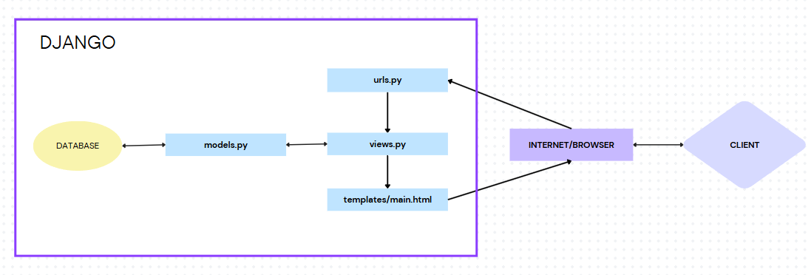

# Platform Based Programming Individual Assignment

Pada tugas ini, saya membuat suatu app e-commerce sederhana dengan ide menjual buku-buku bekas bernama "Second Stories <3". Saya menggunakan konsep bernama MVT pada Django untuk membangun projek ini.

- LINK: [http://sultan-ibnu-prelovedbooks.pbp.cs.ui.ac.id/](http://sultan-ibnu-prelovedbooks.pbp.cs.ui.ac.id/)


# Assignment 3: Implementation of Forms and Data Delivery in Django
## Checklist Tugas

- [x] Membuat input `form` untuk menambahkan objek model pada app sebelumnya.
- [x] Tambahkan 4 fungsi `views` baru untuk melihat objek yang sudah ditambahkan dalam format XML, JSON, XML _by_ ID, dan JSON _by_ ID.
- [x] Membuat routing URL untuk masing-masing `views` yang telah ditambahkan pada poin 2.
- [x] Menjawab beberapa pertanyaan berikut pada `README.md` pada _root_ folder.

### Jelaskan mengapa kita memerlukan _data delivery_ dalam pengimplementasian sebuah platform?

### Menurutmu, mana yang lebih baik antara XML dan JSON? Mengapa JSON lebih populer dibandingkan XML?

### Jelaskan fungsi dari method `is_valid()` pada form Django dan mengapa kita membutuhkan method tersebut?

### Mengapa kita membutuhkan `csrf_token` saat membuat form di Django? Apa yang dapat terjadi jika kita tidak menambahkan `csrf_token` pada form Django? Bagaimana hal tersebut dapat dimanfaatkan oleh penyerang?

### Jelaskan bagaimana cara kamu mengimplementasikan _checklist_ di atas secara _step-by-step_ (bukan hanya sekadar mengikuti tutorial).

- [x] Mengakses keempat URL di poin 2 menggunakan Postman, membuat _screenshot_ dari hasil akses URL pada Postman, dan menambahkannya ke dalam `README.md`.

- [x] Melakukan `add`-`commit`-`push` ke GitHub.


# Assignment 2: Model-View-Template (MVT) implementation in Django
## Checklist Tugas

- [x] Membuat sebuah proyek Django baru.
- [x] Membuat aplikasi dengan nama `main` pada proyek tersebut.
- [x] Melakukan _routing_ pada proyek agar dapat menjalankan aplikasi `main`.
- [x] Membuat model pada aplikasi `main` dengan nama `Product` dan memiliki atribut wajib sebagai berikut.
  - `name`
  - `price`
  - `description`
- [x] Membuat sebuah fungsi pada `views.py` untuk dikembalikan ke dalam sebuah _template_ HTML yang menampilkan nama aplikasi serta nama dan kelas kamu.
- [x] Membuat sebuah _routing_ pada `urls.py` aplikasi `main` untuk memetakan fungsi yang telah dibuat pada `views.py`.
- [x] Melakukan _deployment_ ke PWS terhadap aplikasi yang sudah dibuat sehingga nantinya dapat diakses oleh teman-temanmu melalui Internet.
- [x] Membuat sebuah `README.md` yang berisi tautan menuju aplikasi PWS yang sudah di-_deploy_, serta jawaban dari beberapa pertanyaan berikut.

### Jelaskan bagaimana cara kamu mengimplementasikan _checklist_ di atas secara _step-by-step_ (bukan hanya sekadar mengikuti tutorial)!

- Pertama yang saya lakukan adalah mengaktifkan _virtual environment_ karena seperti yang saya telah pelajari di dalam kelas dan tutorial, _virtual environment_ berfungsi untuk mengisolasi _dependencies_ antar proyek yang berbeda sehingga tidak terjadi hal-hal yang tidak diinginkan.

- Membuat project baru Django dengan perintah `django-admin startproject pre_loved_books .`

- Membuat aplikasi bernama `main` dengan perintah `python manage.py startapp main`. Lalu, daftarkan aplikasi `main` tersebut ke dalam file settings.py di dalam direktori pre_loved_books.

  ```python
  INSTALLED_APPS = [
  'django.contrib.admin',
  'django.contrib.auth',
  'django.contrib.contenttypes',
  'django.contrib.sessions',
  'django.contrib.messages',
  'django.contrib.staticfiles',
  'main', # <------
  ]
  ```

- Membuat file bernama `urls.py` di dalam direktori main yang telah kita buat sebelumnya. Lalu, isi file tersebut dengan

    ```python
	from django.urls import path
    from main.views import show_main

    app_name = 'main'

    urlpatterns = [
        path('', show_main, name='show_main'),
    ]
    ```

* Saya membuat model pada aplikasi main sesuai ketentuan dan menambahkan satu buah atribut dengan code

    ```python
	from django.db import models

    class Product(models.Model):
        name = models.CharField(max_length=255)
        author = models.CharField(max_length=255, default='')
        price = models.DecimalField(decimal_places=2, max_digits=15)
        description = models.TextField()

        @property
        def is_book_expensive(self):
            return self.price > 50000
    ```

* Setelah itu, Di dalam file `views.py` pada aplikasi main saya menambahkan code
    ```python
	from django.shortcuts import render

    def show_main(request):
        context = {
            'name' : 'Norwegian Wood',
            'author': 'Haruki Murakami',
            'price': 100000,
            'description': 'Edisi ini menggunakan bahasa Inggris karena merupakan barang impor. Hanya dibaca oleh diri sendiri dan selalu tersimpan rapih. Tidak ada kerusakan apapun kecuali kertasnya yang mulai menguning.'
        }

        return render(request, "main.html", context)
    ```
  yang nantinya akan menampilkan value sesuai keys di file ini pada file HTML.

* Kemudian, saya menambahkan _routing_ di `urls.py` dalam aplikasi `main` untuk mengatur _path_ yang menghubungkan fungsi yang sudah ada di `views.py`.
    ```python
	from django.contrib import admin
    from django.urls import path,  include

    urlpatterns = [
        path('admin/', admin.site.urls),
        path('', include('main.urls')),
    ]
    ```

* Terakhir, saya menghubungkan repositori saya dengan link yang mengarahkan ke pws lalu melakukan _deployment_ proyek yang telah saya buat agar bisa diakses di internet.

### Buatlah bagan yang berisi _request client_ ke web aplikasi berbasis Django beserta responnya dan jelaskan pada bagan tersebut kaitan antara `urls.py`, `views.py`, `models.py`, dan berkas `html`.

Diagram alur dimulai dari adanya client yang mengirim request di internet atau browsernya. Request itu diarahkan oleh `urls.py` dengan cara memetakan URL yang diminta ke `views.py`. `views.py` lalu memproses request tersebut yang juga dilanjutkan ke `models.py` jika ada data yang perlu disimpan atau diambil dari `database`. Setelah semua sudah terpenuhi, request dari client tadi akan ditampilkan lewat `HTML` yang telah dibuat.

### Jelaskan fungsi `git` dalam pengembangan perangkat lunak!
Dari apa yang telah saya pelajari dan pahami, git sangat berguna khususnya dalam pengembangan perangkat lunak. Git berfungsi sebagai sistem kontrol yang sangat sistematis dan terkoordinasi dalam pengembangan perangkat lunak. Hal itu memudahkan para developer untuk melihat perubahan atau penambahan apa saja yang terjadi, berkolaborasi, menyimpan riwayat kode, dan penggabungan kontribusi dari banyak developer. 

### Menurut Anda, dari semua framework yang ada, mengapa framework Django dijadikan permulaan pembelajaran pengembangan perangkat lunak?
Beberapa alasan menurut pengalaman saya sejuah ini adalah karena Django menyediakan banyak fitur bawaan yang sangat memudahkan pemula bisa lebih fokus memahami bagaimana cara kerja pengembangan perangkat lunak dibandingkan mempelajari code yang rumit. Selain itu, menurut saya, Django memiliki struktur proyek yang rapih dan sistematis sehingga dapat belajar bagaiman cara mengorganisasi code dengan baik.

### Mengapa model pada Django disebut sebagai ORM?
ORM adalah alat yang menerjemahkan kode Python menjadi `SQL`. Di Django, kita hanya perlu mendefinisikan model dan atributnya menggunakan Python, lalu model tersebut akan diubah menjadi `SQL` melalui proses migrasi dan disimpan di folder migrations.
